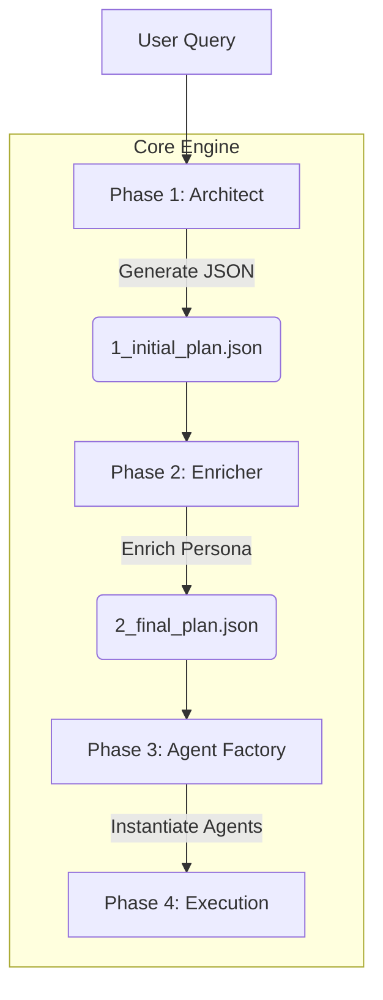

# Dynamic Multi-Agent System (MAS)

사용자의 입력을 분석하여 최적의 에이전트 팀과 워크플로우를 실시간으로 설계하고 실행하는 LLM 기반 멀티에이전트 프레임워크입니다. 고정된 파이프라인 대신, 문제의 성격에 따라 유동적인 협업 구조(DAG)를 생성하여 작업을 수행합니다.

## 📂 Project Structure

```bash
mas_project/
├── .env                    # 환경 변수 (OPENAI_API_KEY)
├── requirements.txt        # 의존성 패키지 목록
├── main.py                 # 프로그램 진입점 (Entry Point)
│
├── prompts/                # [프롬프트 저장소]
│   ├── architect.txt       # 시스템 설계자(Architect) 프롬프트
│   └── enricher.txt        # 페르소나 강화자(Enricher) 프롬프트
│
├── agents/                 # [에이전트 관리]
│   ├── __init__.py
│   ├── system_agents.py    # 고정 에이전트 생성 (Architect, Enricher)
│   └── factory.py          # 설계도 기반 동적 에이전트 생성 (Factory Pattern)
│
├── core/                   # [핵심 엔진]
│   ├── __init__.py
│   └── engine.py           # 전체 파이프라인(Phase 1~5) 제어 및 실행 로직
│
├── config/                 # [설정]
│   ├── __init__.py
│   └── settings.py         # LLM 모델 설정 (gpt-4o-mini 등) 및 파라미터
│
├── utils/                  # [유틸리티]
│   ├── __init__.py
│   └── parser.py           # LLM 응답에서 JSON 추출 및 유효성 검증
│
└── logs/                   # [로그 및 결과]
                            # 1_initial_plan.json (초안)
                            # 2_final_plan.json (보강안)
                            # report_YYYYMMDD.md (최종 보고서)

```

## System Architecture & Workflow

이 시스템은 **'설계 → 보강 → 생성 → 실행'** 의 4단계 프로세스로 동작하며, 각 단계는 JSON 파일을 매개체로 하여 데이터를 교환합니다.



### 상세 실행 흐름

1. **Phase 1: Architect (기초 설계)**
   - **Architect 에이전트**가 시스템의 총괄 설계자로서 사용자의 요구사항을 심층 분석합니다.
   - 문제를 해결하는 데 가장 적합한 **최적의 전문가 역할(Roles)** 을 선정하고, 그들이 협업할 **업무 흐름(Workflow)** 을 직접 기획합니다.
   - 작업의 성격에 따라 '순차적 처리(Linear)'가 필요한지, '종합적 판단(Convergent)'이 필요한지 스스로 판단하여 설계합니다.
   - *결과물:* `logs/1_initial_plan.json` (기초 설계도)

2. **Phase 2: Prompt Enricher (페르소나 고도화)**
   - 설계된 기초 역할(Role)에 **구체적인 방법론, 분석 도구, 전문 지식**을 주입합니다.
   - '1_initial_plan.json'에서의 단순한 역할 정의를 **상세 페르소나**로 업그레이드합니다.
   - *결과물:* `logs/2_final_plan.json` (최종 설계도)

3. **Phase 3: Agent Factory (인스턴스 생성)**
   - Phase 1과 2를 거쳐 **완성된 '에이전트 설계도'** 를 로드합니다.
   - 설계도에 명시된 페르소나와 설정을 그대로 반영하여, 실제 실행 가능한 `AssistantAgent` 객체(Instance)들을 **생성**합니다.

4. **Phase 4: Execution (협업 실행)**
   - 생성된 전문가 에이전트들이 설계된 그래프(Graph) 순서에 맞춰 **실제 문제 해결 작업**을 수행합니다.
   - **컨텍스트 전달:** 모든 정보를 무조건 공유하는 것이 아니라, `depends_on`에 명시된 **'필수 참조 데이터'** 만 선별하여 다음 단계로 넘깁니다.


---


## Installation & Usage

### 1. 환경 설정


```bash

# 패키지 설치
pip install -r requirements.txt

```

### 2. API 키 설정

프로젝트 루트에 `.env` 파일을 생성하고 OpenAI API 키를 입력합니다.

```ini
OPENAI_API_KEY=sk-your-api-key-here

```

### 3. 실행

`main.py`를 실행하여 쿼리를 입력합니다.

```bash
python main.py

```

## Configuration

* **`config/settings.py`**: 사용할 LLM 모델(Model ID), Temperature, Timeout 등을 설정할 수 있습니다.
* **`prompts/`**: `architect.txt`와 `enricher.txt`를 수정하여 시스템의 설계 성향이나 페르소나 부여 방식을 조정할 수 있습니다.

